# Project-101 - Crypto Analysis before, during and after Covid-19 lockdown.
### The code behind this project can be found by clicking here: [Project 101 Crypto Analysis](crypyo_analysis_project.ipynb)

This project consists in a thorough analysis of the price movement of four major Cryptocurrencies (Bitcoin, Ethereum, Cardano and Binance), and identifying signals of future performance of Bitcoin!

 S&P500 Closing prices for last three years!

The S&P500 is a stock market index that tracks the stocks of 500 large-cap U.S. companies. It represents the stock market's performance by reporting the risks and returns of the biggest companies. Investors use it as the benchmark of the overall market, to which all other investments are compared.

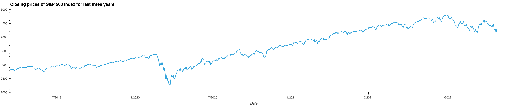

PART ONE: CRYPTO ANALYSIS!

Crypto Analysis: I - Before Covid-19 Lockdown Period:

* Creating a plot of the price movement for Cryptocurrencies before the Covid-19 lockdown period!
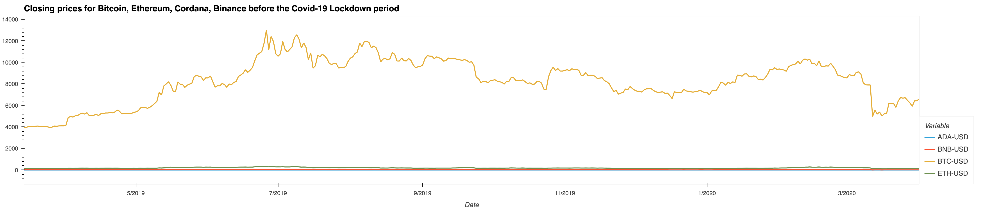

* Creating a plot of daily returns to have a better way of demonstrating of what would have happened on certain dates if you have invested in any cryptocurrency and what would have been the percentage return on that specific date:
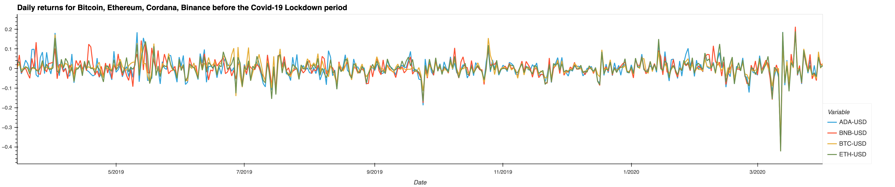

* Volatility before Covid-19 Lockdown period: 

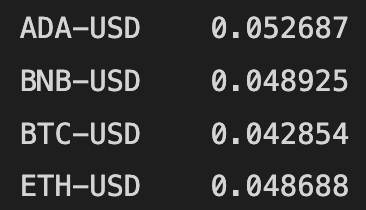

Volatility is a measure of change in the price of an asset over time. The higher the standard deviation, the more volatile an asset is, in this case Cordana has a higher volatility than the rest of the other Cryptos!

* Creating a plot of cumulative returns for Cryptocurrencies before the Covid-19 lockdown period, cumulative return indicates the aggregate effect of price change on the value of your investment. 
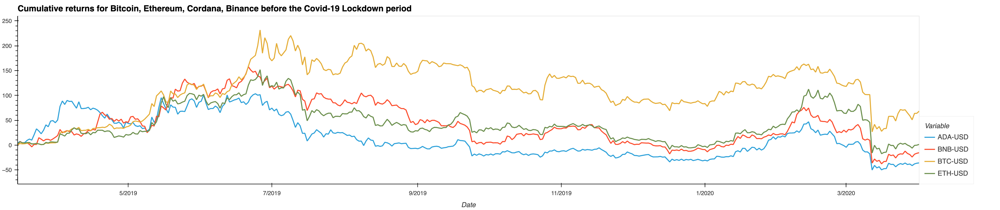

The cumulative return doesn't always equate to an accumulation of wealth. A cumulative return can be negative. If you bought BTC for $8,562 and it is trading at $4,963 a year later, your cumulative return is negative: ( $4,963 - $8,562 ) / $8562 = -0.42034571361831347 = (42%)

* Creating a heatmap of correlation between Cryptocurrencies before the Covid-19 lockdown period:

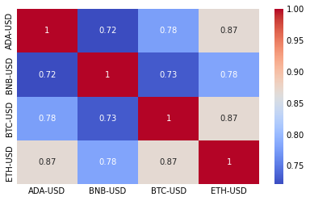

Correlation is an indicator that shows if there is a mutual relationship or connection between each Crypto.
Here we can see that Bitcoin and Ethereum have a high correlation of 87%, also Binance shows a correlation of 78% with Ethereum and 73% with Bitcoin.

Crypto Analysis: II - During Covid-19 Lockdown Period:

* Creating a plot of the price movement for Cryptocurrencies during the Covid-19 lockdown period!
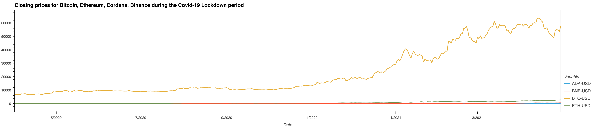

* Creating a plot of daily returns to have a better way of demonstrating of what would have happened on certain dates if you have invested in any cryptocurrency and what would have been the percentage return on that specific date:
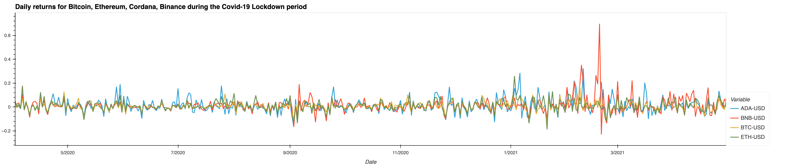

* Volatility during Covid-19 Lockdown period: 

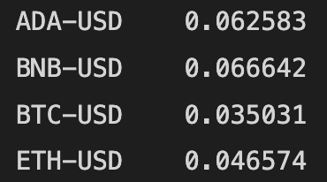

Volatility is a measure of change in the price of an asset over time. The higher the standard deviation, the more volatile an asset is, in this case we can see that Binance has a higher volatility than the rest of the other Cryptos!

* Creating a plot of cumulative returns for Cryptocurrencies before the Covid-19 lockdown period, cumulative return indicates the aggregate effect of price change on the value of your investment. 
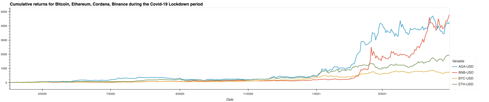

If you bought BTC for $4,963 and it is trading at $44,354.63 a year later, your cumulative return is: ( $44,354 - $4,963 ) / $4,963 = 7.9369  OR IN PERCENTAGE THIS WILL BE 793.69% UNBELIEVABLE RIGHT!!!!! 

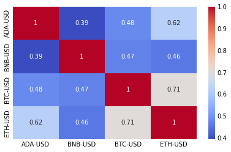

Correlation is an indicator that shows if there is a mutual relationship or connection between each Crypto.
Here we can see that Bitcoin and Ethereum have a high correlation of 71%, Cordana has a correlation of 48% with Bitcoin and 62% with Ethereum, also Binance shows a correlation of 47% with Bitcoin.

Crypto Analysis: III - After Covid-19 Lockdown Period:

* Creating a plot of the price movement for Cryptocurrencies after the Covid-19 lockdown period!
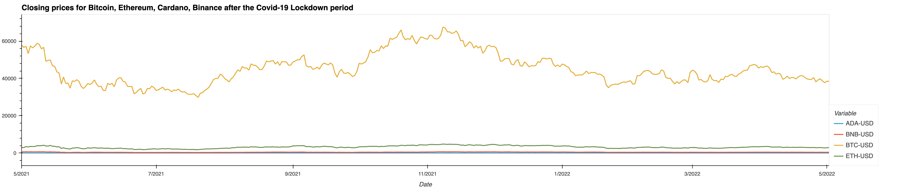

* Creating a plot of daily returns to have a better way of demonstrating of what would have happened on certain dates if you have invested in any cryptocurrency and what would have been the percentage return on that specific date:
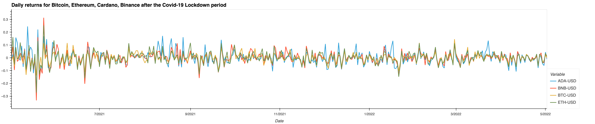

* Volatility after Covid-19 Lockdown period: 

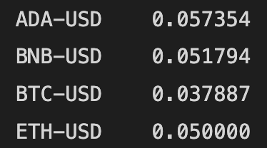

Volatility is a measure of change in the price of an asset over time. The higher the standard deviation, the more volatile an asset is, in this case we can see that Binance has a higher volatility than the rest of the other Cryptos!

* Creating a plot of cumulative returns for Cryptocurrencies before the Covid-19 lockdown period, cumulative return indicates the aggregate effect of price change on the value of your investment. 
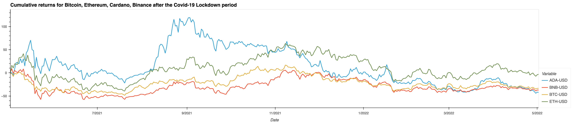

If you bought BTC on March 1 2022 for $44,354.63 and it is trading at ( Hypothetically ) $100,000 a year later, your cumulative return will be:
( $100,000 - $44,354.63 ) / $44,354.63 =  1.2545 OR IN PERCENTAGE THIS WILL BE 125.45% UNBELIEVABLE!!!!! 

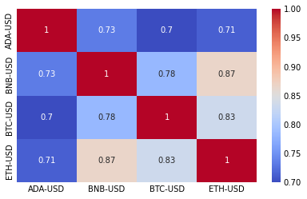

Correlation is an indicator that shows if there is a mutual relationship or connection between each Crypto.
Here we can see that Bitcoin shows a high correlation of 83% with Ethereum and 70% with Cordana; 
Also Binance shows a correlation of 87% with Ethereum, and 78% with Bitcoin.

PART TWO: BITCOIN ANALYSIS USING FIBONACCI RETRACEMENT!

BTC Analysis: I - Before Covid-19 Lockdown Period:

* Cleaning data and Creating a variable for Bitcoin Closing prices, before Covid-19 Lockdown period:
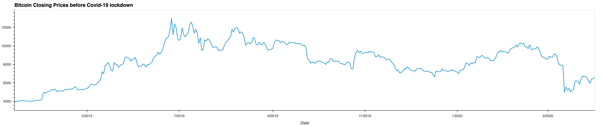

Quantitative traders always look for trading opportunities based on technical indicators and advanced charts. One of the best kinds of indicators traders look for is made by key levels at which the price could bounce. Some of these levels are Fibonacci retracements.

Fibonacci retracements are particular key levels calculated according to 2 swings, i.e. inversion points. 
The idea behind Fibonacci retracements is to create some key levels in the price range between these two swings according to pre-defined fractions. 
The most important fraction is 0.618, which is related to the golden ratio (1.618…). That’s why they are called Fibonacci retracements. Other ratios are 0.5, 0.236, 0.382, 0.786.
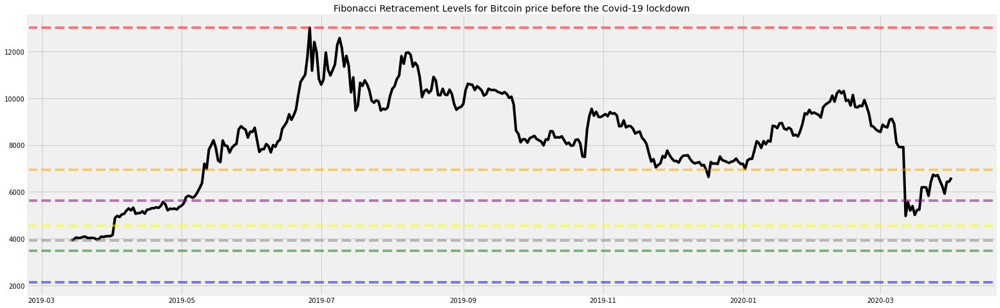

In this visualization, we can see the 10-period simple moving average (red line) charting against the 5-period exponential moving average (green line.) Visualized together, we can see a shift in momentum in many areas where the EMA crosses the SMA. Given the EMA reflects a faster change in price momentum, this crossover pattern is often used as a composite technical indicator to forecast emerging price trends.

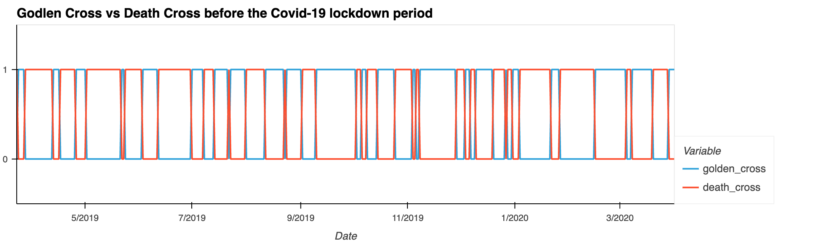

A Golden Cross indicates a long-term bull market going forward, while a death cross signals a long-term bear market. Both refer to the solid confirmation of a long-term trend by the occurrence of a short-term moving average crossing over a major long-term moving average.
The Death Cross having more moving averages converging together shows a very strong indication of a sell-off. If the volume after the Death Cross shows a significant rise, then the downward trend is likely to gain strength.

BTC Analysis: II - During Covid-19 Lockdown Period:

* Cleaning data and Creating a variable for Bitcoin Closing prices, during Covid-19 Lockdown period:
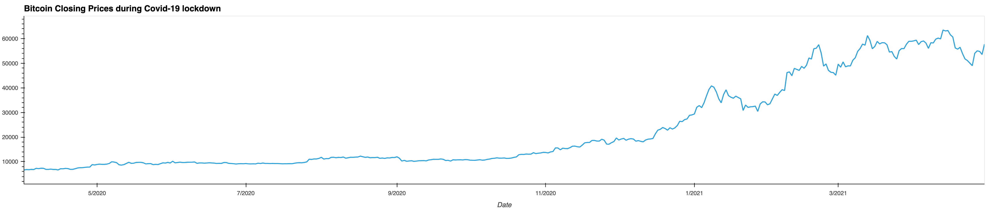

Quantitative traders always look for trading opportunities based on technical indicators and advanced charts. One of the best kinds of indicators traders look for is made by key levels at which the price could bounce. Some of these levels are Fibonacci retracements.

Fibonacci retracements are particular key levels calculated according to 2 swings, i.e. inversion points. 

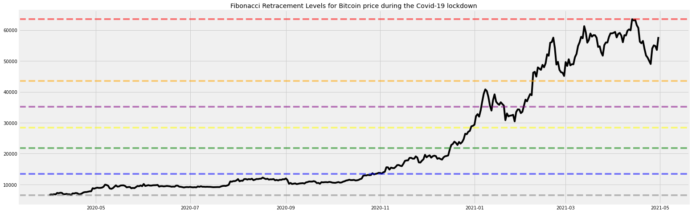

The idea behind Fibonacci retracements is to create some key levels in the price range between these two swings according to pre-defined fractions. 
The most important fraction is 0.618, which is related to the golden ratio (1.618…). That’s why they are called Fibonacci retracements. Other ratios are 0.5, 0.236, 0.382, 0.786.

In this visualization, we can see the 10-period simple moving average (red line) charting against the 5-period exponential moving average (green line.) Visualized together, we can see a shift in momentum in many areas where the EMA crosses the SMA. Given the EMA reflects a faster change in price momentum, this crossover pattern is often used as a composite technical indicator to forecast emerging price trends.

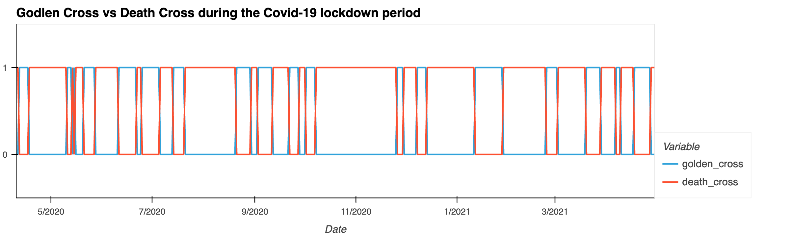

A Golden Cross indicates a long-term bull market going forward, while a death cross signals a long-term bear market. Both refer to the solid confirmation of a long-term trend by the occurrence of a short-term moving average crossing over a major long-term moving average.
The Death Cross having more moving averages converging together shows a very strong indication of a sell-off. If the volume after the Death Cross shows a significant rise, then the downward trend is likely to gain strength.

BTC Analysis: III - After Covid-19 Lockdown Period:

* Cleaning data and Creating a variable for Bitcoin Closing prices, after Covid-19 Lockdown period:
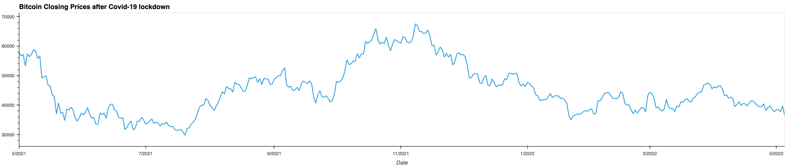

Quantitative traders always look for trading opportunities based on technical indicators and advanced charts. One of the best kinds of indicators traders look for is made by key levels at which the price could bounce. Some of these levels are Fibonacci retracements.

Fibonacci retracements are particular key levels calculated according to 2 swings, i.e. inversion points. 

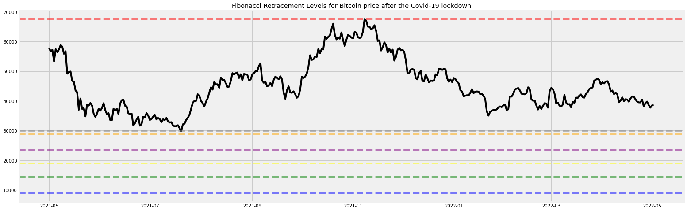

The idea behind Fibonacci retracements is to create some key levels in the price range between these two swings according to pre-defined fractions. 
The most important fraction is 0.618, which is related to the golden ratio (1.618…). That’s why they are called Fibonacci retracements. Other ratios are 0.5, 0.236, 0.382, 0.786.

In this visualization, we can see the 10-period simple moving average (red line) charting against the 5-period exponential moving average (green line.) Visualized together, we can see a shift in momentum in many areas where the EMA crosses the SMA. Given the EMA reflects a faster change in price momentum, this crossover pattern is often used as a composite technical indicator to forecast emerging price trends.

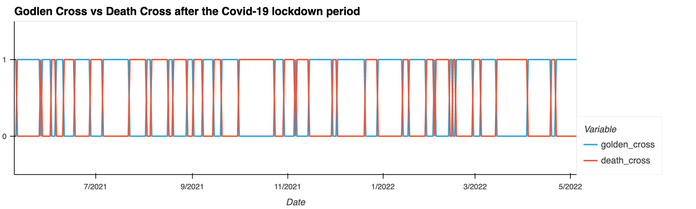

A Golden Cross indicates a long-term bull market going forward, while a death cross signals a long-term bear market. Both refer to the solid confirmation of a long-term trend by the occurrence of a short-term moving average crossing over a major long-term moving average.
The Death Cross having more moving averages converging together shows a very strong indication of a sell-off. If the volume after the Death Cross shows a significant rise, then the downward trend is likely to gain strength.

